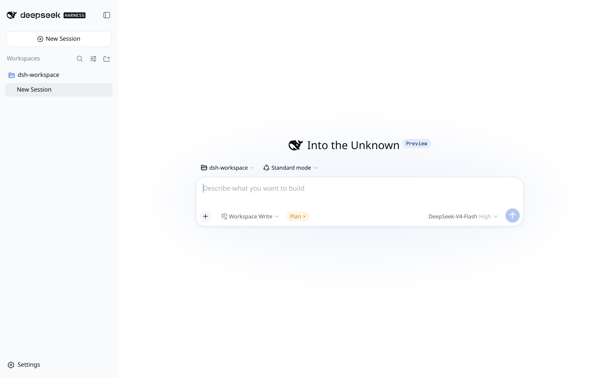
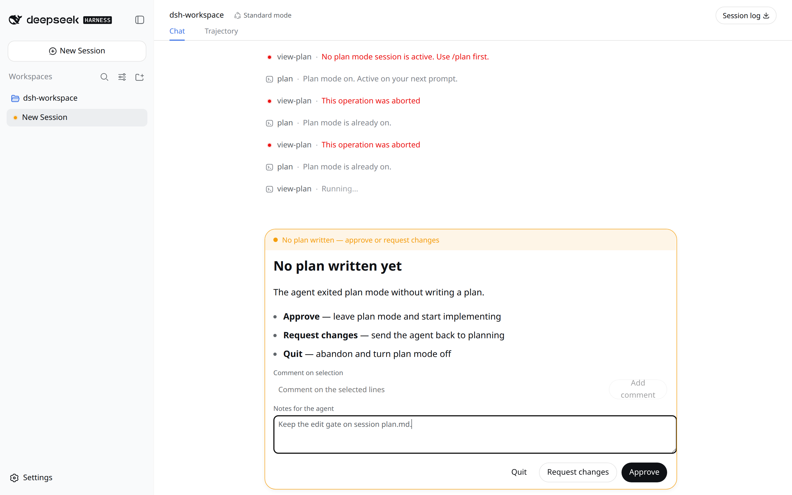
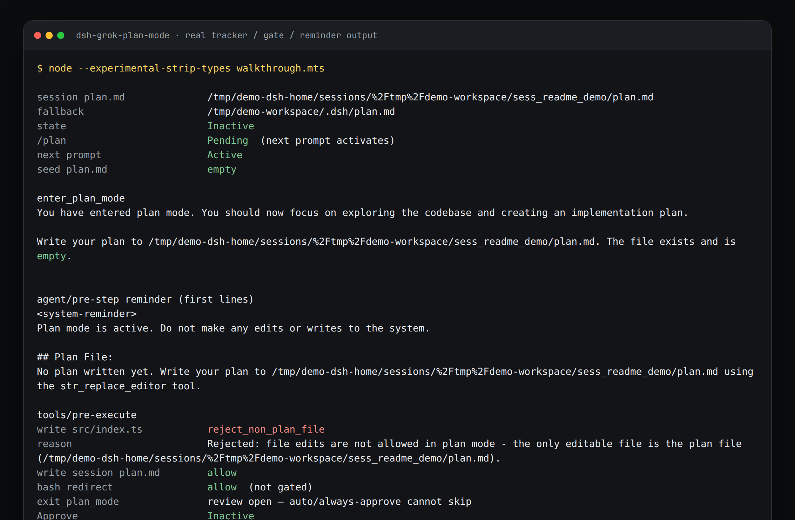

[中文](README.md) | English

# dsh-grok-plan-mode

Grok Build Plan Mode on [DeepSeek Harness](https://github.com/deepseek-ai/deepseek-harness) Web.

`/plan` locks the session to one writable file: that session’s `plan.md`. When the model calls `exit_plan_mode`, you get a review card — Approve, Request changes, or Quit. Auto / always-approve **do not skip it**.

Official DSH Plan is a prompt plus two buttons. It does **not** stop file writes. This plugin does.

No DSH source patch. The port tracks Grok Build at `dsh-v0.1.0-rc.8`: `PlanModeTracker`, `plan_mode_edit_gate`, `enter_plan_mode` / `exit_plan_mode`, and the approval surface. Spec: [xAI Plan Mode](https://docs.x.ai/build/features/plan-mode).


These shots are official DeepSeek Harness Web `0.1.0-rc.8` after this plugin is installed: sidebar, **Into the Unknown**, the real input box. Frame 0 of the GIF is already that composer with the Plan chip. No black lead-in.

## What you see

### Plan chip

DSH Web has no Shift+Tab. After `/plan`, a **Plan** pill sits on the composer. Click × or run `/grok-plan-leave` to leave. During review it reads **Plan approval**.



### Review card

`exit_plan_mode` and `/view-plan` open the same card. Select lines to comment; leave notes for the model. An empty plan still opens it.




- **Approve** — leave Plan and implement `plan.md`
- **Request changes** — keep Plan on, send notes / line comments back
- **Quit** — drop the plan and turn Plan mode off

### Edit gate

While Active, `write` / `edit` / `str_replace_editor` / `apply_patch` may only touch the session `plan.md`. This is real output from this repo’s tracker and gate, not a mock transcript:



Bash is not gated. Redirects can write files. Grok’s docs gate edit tools, not the shell; this port does not “fix” that. Subagents (`origin === 'subagent'` or `delegationDepth > 0`) do not inherit the parent gate.

## Install

Unload official Plan first. `/plan`, `exit_plan_mode`, and `conversation.input.plan` are single seats. They **cannot be double-registered**.

The package declares `dsh.bundle`. From a Harness tree:

```sh
git clone https://github.com/aa2246740/dsh-grok-plan-mode.git \
  /path/to/deepseek-harness/my-plugins/dsh-grok-plan-mode

cd /path/to/deepseek-harness
pnpm dsh plugin --profile web add link:./my-plugins/dsh-grok-plan-mode
# or: pnpm dsh plugin --profile web add github:aa2246740/dsh-grok-plan-mode

pnpm dsh web --no-open --port 3080
```

`cordis.yml` disables host `ui-plan` / `plan-mode` and inserts this plugin (`name: dsh-grok-plan-mode`, so `__DSH_BOOT__` sees `dsh.client`).

Web remounts official `plan-mode` inside presets `standard` / `code` / `cordis`. Host-only is not enough. Merge [`overlays/preset.plan-off.yml`](overlays/preset.plan-off.yml) into those preset copies. This plugin will not edit those three Harness files for you.

Do not stack a dshx `--patch` on top of the bundle — same plugin id twice.

Install from a commit that includes `lib/client.js` (RC8 lazy-CJS). Or `pnpm build` on a Harness that has dshx `externalClientBundle`.

Still in the dshx workshop, not yet in `dsh.profile.bundles`:

```sh
dshx check dsh-grok-plan-mode
dshx verify-boot dsh-grok-plan-mode --keep
```

`verify-boot` only proves host `apply()` and HTTP. The client row needs the official bundle install above; `name` must be the package name, not `src/index.ts`.

## Commands and tools

| Entry | What it does |
|---|---|
| `/plan` | Enter; becomes Active on the next prompt |
| `/plan <text>` | Enter and start this turn |
| `/view-plan` `/show-plan` `/plan-view` | Open the saved plan |
| chip × / `/grok-plan-leave` | Leave |
| `enter_plan_mode` | Model enters when the task is ambiguous (not a permission dialog) |
| `exit_plan_mode` | Read `plan.md` from disk and stop at review; tool args are empty |

## Files

```
~/.dsh/sessions/<urlencoded-cwd>/<session-id>/plan.md
~/.dsh/sessions/<urlencoded-cwd>/<session-id>/plan_mode.json
```

`DSH_HOME` moves the root. With no session path, fall back to `$cwd/.dsh/plan.md`. Missing files are created empty and **never truncated**.

## vs official DSH Plan / Grok

| Behavior | Grok | This plugin |
|---|---|---|
| State | `Inactive → Pending → Active → ExitPending` | Same |
| Resume | `Pending` / `ExitPending` collapse; `plan_mode.json` | session event `grok-plan/state` + `plan_mode.json` above |
| Plan file | session `plan.md`, else `.grok/plan.md` | session `plan.md`, else `$cwd/.dsh/plan.md` |
| `/plan` | Next prompt; with text, start a turn | Same |
| Edit gate | Active: only session `plan.md`; auto still blocked | Hard deny on `tools/pre-execute` |
| bash | Not gated | Same |
| Subagents | Parent gate does not inherit | Skip when `origin === 'subagent'` or `delegationDepth > 0` |
| Review | Empty plan still opens; auto cannot skip | Web buttons and line comments; no TUI keybindings |

## Not ported

- TUI LineViewer / keys `a s c q Tab`. Same outcomes, Web buttons and selection comments.
- Shift+Tab mode cycle. DSH composer has no seam for it.
- Bash command inspection.
- Official Goal stack. `/goal` is untouched.

## Tests

Tracker, gate, reminders, review copy, and plan-file seeding do not need DSH:

```sh
npm test
```

On a Harness checkout you can also run the RC8 service tests (no Web):

```sh
DSHX_HARNESS=/path/to/deepseek-harness \
  pnpm --dir "$DSHX_HARNESS" exec vitest run \
  --config my-plugins/dsh-grok-plan-mode/vitest.live.config.ts
```

## Source pointers

- Grok state machine: `crates/codegen/xai-grok-shell/src/session/plan_mode.rs`
- Grok edit gate: `crates/codegen/xai-grok-shell/src/session/acp_session_impl/tool_calls.rs` (`plan_mode_edit_gate`)
- Grok enter/exit tools: `crates/codegen/xai-grok-tools/src/implementations/grok_build/{enter,exit}_plan_mode`
- Grok approval view: `crates/codegen/xai-grok-pager/src/views/plan_approval_view.rs`
- Official DSH Plan (replaced): `packages/plan/plan-mode`, `packages/client/ui-plan`
