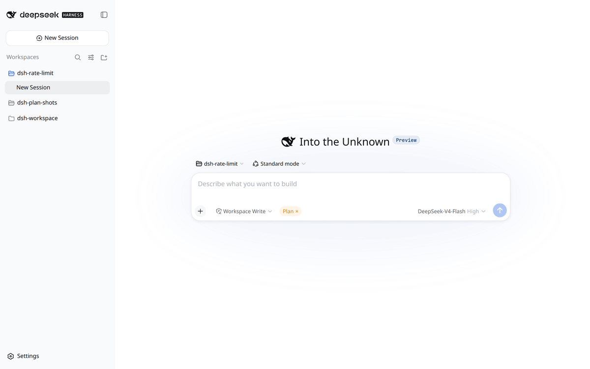
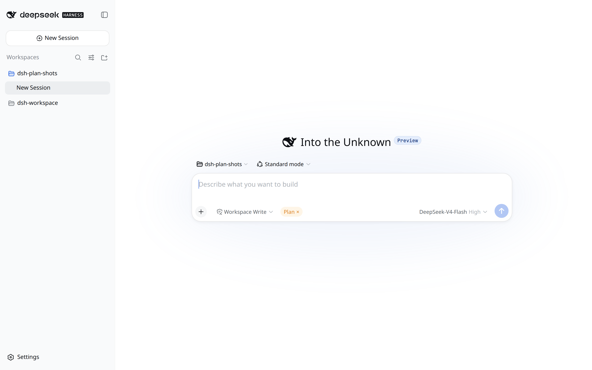

[中文](README.md) | English

# dsh-grok-plan-mode

## Maintenance paused (2026-09-15)

This project is not currently maintained or recommended as a replacement for DeepSeek Harness Plan. Use the official DSH `/plan`. The source remains available for research. For Grok's native Plan workflow, use Grok itself.

### Why maintenance is paused

The implementation takes over `/plan`, enter/exit tools, edit restrictions, approval handoff, session state, and composer controls. It also uses Cordis lifecycle hooks to suppress official Plan instances in existing and future Agent presets, while its profile bundle disables official `ui-plan` / `plan-mode` entries. Replacing Plan therefore depends on DSH's session and runtime behavior.

Preset changes, tool approval, history replay, state projections, and plugin loading must be verified together. Legacy custom `grok-plan/state` events previously made some session histories unreadable by the official persistence layer, requiring compatibility work. Removing the package alone is also insufficient: the bundle's disabling rules and active replacements must be undone. The cost of coupled changes and regression checks has become too high to continue adapting this replacement.

### Existing installations

Use an external Agent and DSHX `plugin remove dsh-grok-plan-mode --profile web --port <current-port>`, then verify that official Plan commands, tools, and UI work again. The Loader row ID is `grok-plan-mode`, which differs from the package name. If DSHX cannot prove `HOST_TREE_INACTIVE`, an external supervisor must verify and disable the actual row, restore official `ui-plan`, and retry the same removal command before removing package files. Restore `plan-mode` according to the original profile/preset composition instead of enabling it globally. Preserve session directories, `plan.md`, and `plan_mode.json`. If old history contains `grok-plan/state` events that the current DSH cannot read, back it up before addressing compatibility; do not delete history as a workaround. Pausing maintenance does not approve or complete any existing plan.

The remaining sections document the experimental implementation for research and are no longer current installation recommendations.

---

Replace official DeepSeek Harness Plan with Grok's hard gate.

```sh
dsh plugin --profile web add github:aa2246740/dsh-grok-plan-mode
```

You need **pnpm** on PATH, plus `dsh` (or `npx @deepseek-ai/dsh`). Then **restart that Host and reload the page**. `dsh plugin add` only writes the profile; it does not hot-load a running process. This repo commits `lib/`, so a git install does not need a build.

If `dsh` is not on PATH:

```sh
npx @deepseek-ai/dsh plugin --profile web add github:aa2246740/dsh-grok-plan-mode
```

Or from a clone:

```sh
git clone https://github.com/aa2246740/dsh-grok-plan-mode.git
dsh plugin --profile web add ./dsh-grok-plan-mode
```

```sh
dsh plugin --profile web remove dsh-grok-plan-mode
```

This is for official DSH **0.1.5-rc.2** `web` profiles. The DSH.app plugin window accepts npm names only; Desktop users should run `dsh web` and the command above.

After `/plan`, the model can only edit this session's `plan.md`. `exit_plan_mode` opens a review card: Chat about it, Quit, Approve. auto / always-approve cannot skip it.

Official DSH Plan is a prompt plus two buttons. It does not block file writes. This plugin does. See [xAI Plan Mode](https://docs.x.ai/build/features/plan-mode).






DSH Web has no Shift+Tab. After `/plan`, **Plan** appears on the composer. Click × or type `/plan off` to leave. During review the chip becomes **Plan approval**.

`cordis.yml` disables host `ui-plan` / `plan-mode` and inserts this plugin. `/plan`, `exit_plan_mode`, and `conversation.input.plan` are single-seat; do not mount official Plan again.

The review card uses the same three actions as official DSH Plan. It does not put line comments on the card:

- Chat about it: stay in Plan and send Grok Request changes so the model revises; type extra detail in the composer after the card closes
- Quit: drop the plan and leave Plan mode
- Approve: leave Plan and implement `plan.md`

While Active, `write` / `edit` / `str_replace_editor` / `apply_patch` can only touch this session's `plan.md`. bash is not gated. Subagents do not inherit the parent gate.

Plan is replaced across Standard, PTC, Minimal, Creator Mode, and later custom presets on this Host. A Cordis lifecycle observer suppresses official Plan rows before activation and replaces existing instances without rewriting preset files. Active legacy plans migrate conservatively into Grok Plan without approval. Unloading restores the runtime rows owned by this replacement.

## Commands

| Entry | What |
|---|---|
| `/plan` | Enter. Active on the next prompt |
| `/plan <text>` | Enter and start this turn |
| `/plan off` | Leave (same as the chip ×) |
| `/view-plan` `/show-plan` `/plan-view` | Open the saved plan |
| `/grok-plan-leave` | Leave (alias) |
| `enter_plan_mode` | Model enters on its own |
| `exit_plan_mode` | Read `plan.md` on disk and stop for review |

Files:

```
~/.dsh/sessions/<urlencoded-cwd>/<session-id>/plan.md
~/.dsh/sessions/<urlencoded-cwd>/<session-id>/plan_mode.json
```

With no cwd it falls back to `.grok/plan.md`, same as Grok Build. Missing files are created empty. Existing content is never truncated.

## License

MIT. See [LICENSE](LICENSE).
